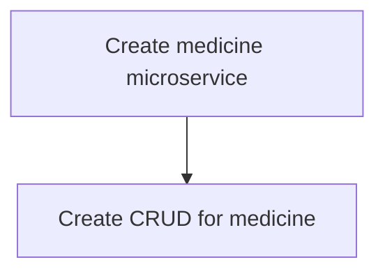
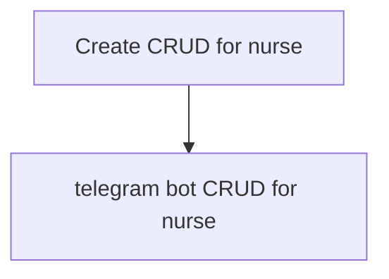
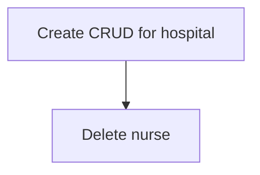

1.

```mermaid
flowchart TD
  A[Create medicine microservice] --> B[Create CRUD for medicine]
```

2.

```mermaid
flowchart TD
  A[Create CRUD for nurse] --> B[telegram bot CRUD for nurse]
```

3.

```mermaid
flowchart TD
  A[Create CRUD for hospital] --> B[Delete nurse]
```

4.

```mermaid
flowchart TD
  A[create microservice reporter]
```